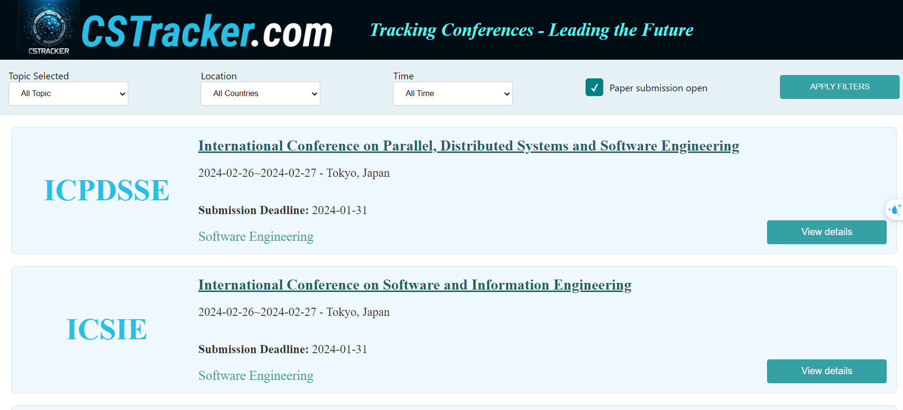
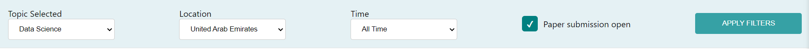
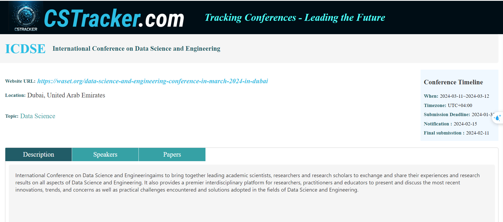
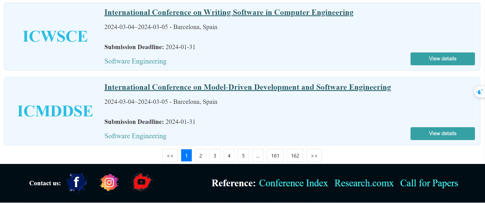
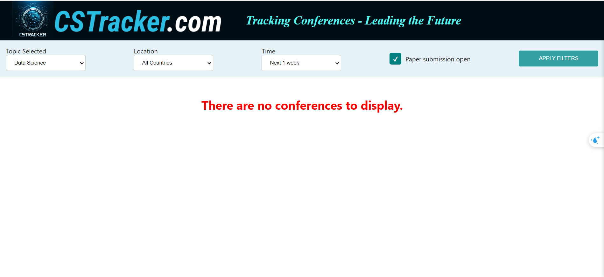
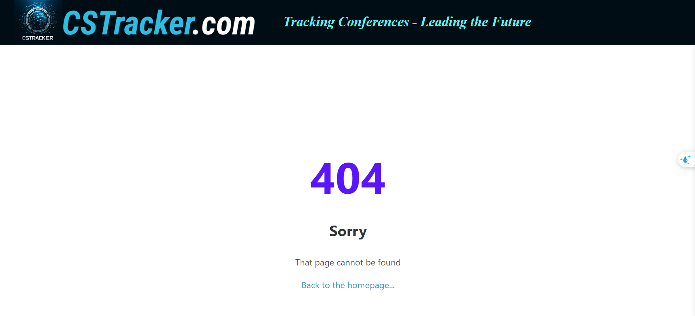

# **ĐỒ ÁN NHẬP MÔN CÔNG NGHỆ PHẦN MỀM - NHÓM 16**
- Thành viên: 

| STT | MSSV     | Họ và tên          |
| --- | -------- | ------------------ |
| 1   | 21120275 | Huỳnh Cao Khôi     |
| 2   | 21120302 | Huỳnh Trí Nhân     |
| 2   | 21120308 | Phạm Lê Tú Nhi     |
| 2   | 21120607 | Trần Thị Kim Huỳnh |

## Giới thiệu

**Chủ đề đồ án**: Website hiển thị thông tin hội nghị sử dụng dữ liệu từ chương trình web crawler.

**Quy trình phần mềm áp dụng**: Waterfall cải tiến. Điểm khác biệt với quy trình Waterfall cổ điển là nếu có thay đổi trong quá trình thực hiện đồ án thì sẽ quay lại một giai đoạn trong quy trình, thay vì quay lại giai đoạn đầu tiên. Quy trình áp dụng phù hợp với yêu cầu của đồ án dựa trên xem xét về kinh nghiệm của các thành viên, cùng với thứ tự các bài tập kèm theo (template) đều có điểm dựa theo việc sử dụng quy trình phần mềm. 

Lý do nhóm sử dụng quy trình Waterfall cải tiến vì trong quá trình phát triển sẽ khó tránh khỏi việc thay đổi các yếu tố không phù hợp.

**Mô hình sử dụng**: là mô trình MVC. Vì sản phẩm thực hiện là một website nên cũng có thể xem là theo mô hình client-server.

Bản thiết kế ứng dụng có thể được xem thêm tại [đây](https://www.figma.com/file/5QlbmHHB0nevEGVfW7QZ0s/CS-Tracker?type=design&node-id=0%3A1&mode=design&t=kvhRmzNsiosQDpRh-1).

## Công nghệ sử dung
- Lập trình backend: `NodeJS`
- Lập trình frontend: `ReactJS`
- Cơ sở dữ liệu: `MongoDB`
- Công cụ quản lý dự án: `Github`
- Công cụ lập trình: `Visual Studio Code`
- Công cụ thiết kế: `Figma`
- Công cụ quản lý phiên bản: `Git`
- Tổ chức thư mục:
  - `backend`: chứa mã nguồn phía backend
    - `crawler`: chứa mã nguồn gửi yêu cầu thu thập dữ liệu từ trang web.
    -  `database`: chứa nội dung cơ sở dữ liệu
    -  `models`: chứa các model của cơ sở dữ liệu
    -  `routes`: chứa các route của ứng dụng
    -  `app.js`: file khởi chạy backend
  - `frontend`: chứa mã nguồn phía frontend
    - `public`: chứa các file tĩnh
      - `index.html`: file html khởi chạy ứng dụng
    - `src`: chứa mã nguồn phía frontend
      - `components`: chứa các component của ứng dụng
        - `js` : chứa các file js (Header, Footer, ConfereceInfo, ConferenceShortInfo, FilterForm)
        - `scss`: chứa các file .scss tương ứng với các file js
        - `images`: chứa các file ảnh
      - `App.jsx`: file khởi chạy frontend
      - `App.css`: file css chung
      - `index.js`: file khởi chạy ứng dụng
      - `index.css`: file css chung

## Cài đặt và chạy thử
- Cài đặt `NodeJS` và `MongoDB`
- Clone project về máy
- Mở terminal và chạy lệnh `npm install` để cài đặt các thư viện cần thiết ở từng thư mục `backend` và `frontend`
- import file `database/Confereces.json` vào cơ sở dữ liệu ở mongoDB tại `localhost:27017/yourDatabase/confereces`
- Ở thư mục `backend`, mở terminal và chạy lệnh `npm start` để khởi chạy server
- Ở thư mục `client`, mở terminal và chạy lệnh `npm start` để khởi chạy ứng dụng

## Các chức năng đã hoàn thành của trang web
- Hiển thị danh sách các hội nghị

- Lọc hội nghị theo yêu cầu

- Xem chi tiết hội nghị

- Chia trang danh sách hội nghị

- Không có hội nghị nào thỏa mãn yêu cầu

- Có lỗi xảy ra

